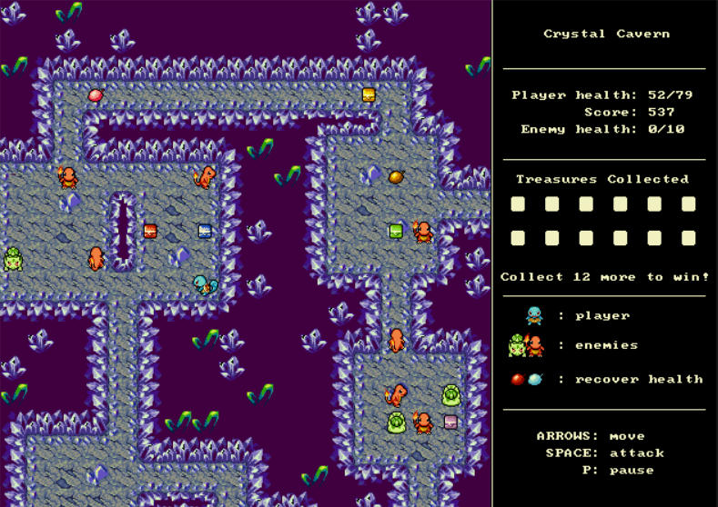

# Crystal Cavern

This repo contains the code for a Pokemon-based dungeon crawler, loosely inspired by the [Pokemon Mystery Dungeon](https://en.wikipedia.org/wiki/Pok%C3%A9mon_Mystery_Dungeon) games. The game is written entirely in assembly for the course EECS 205: Fundamentals of Computer Systems Software.

## Game Description
You control a Pokemon who has been dropped into a dungeon. Wandering around the dungeon are other Pokemon, and some of them are guarding treasures. Be careful, though! The enemies will move towards and start attacking you once they see you. It is your job to defeat these Pokemon, collect the twelve treasures, and escape the dungeon. 

## Gameplay
 * Use **arrow keys** to control player motion. 
 * Use **spacebar** to attack enemies.
 * Walk over treasure chests, berries, and music notes to collect them and activate their effects.

## Requirements
The repo contains a working, playable `game.exe`. To build it yourself, use [MASM32](http://www.masm32.com).
